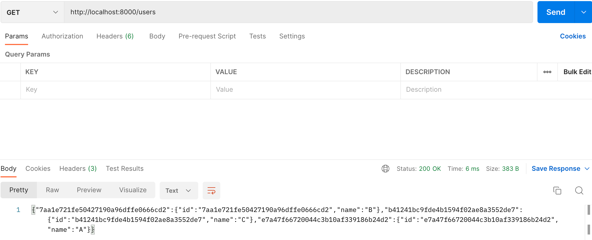
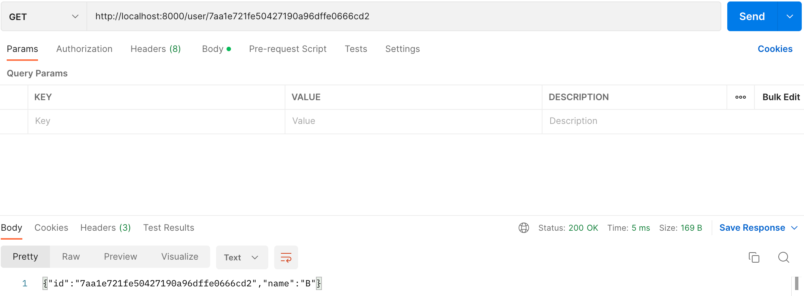
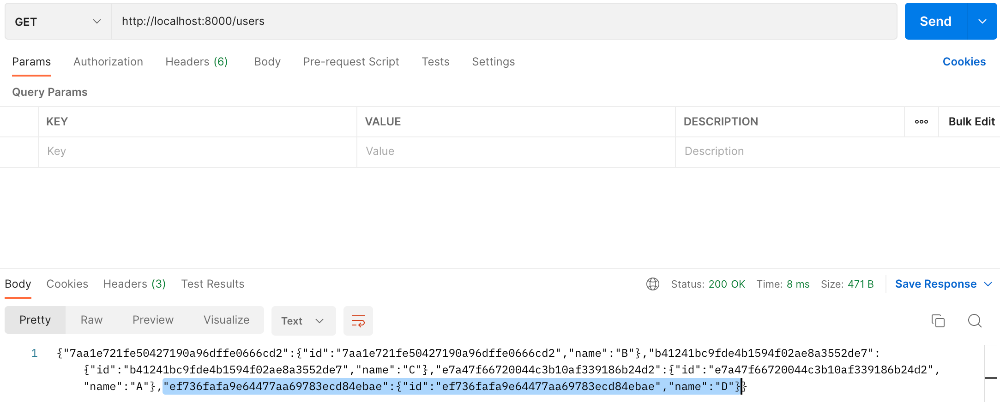
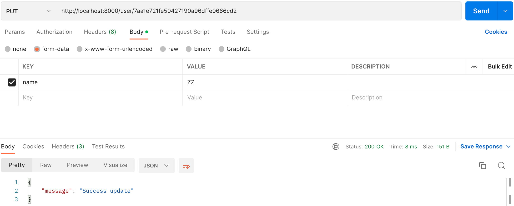
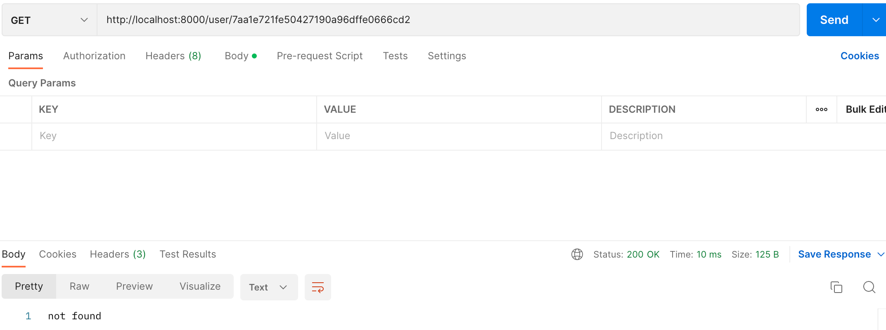

# Gin Framework Practice REST API CRUD  

## Initialize：  
Main

```go
func init() {
	models.Insert("A")
	models.Insert("B")
	models.Insert("C")
}

func main() {
	fmt.Printf("start")
	router := router.InitRouter()
	router.Run(":8000")
}
```

Model
```go
var Map = make(map[string]User)

type User struct {
	ID       string `json:"id"`
	Username string `json:"name"`
}
```


## Get：  
Router
```go
router.GET("/users", controller.GetUsers)
router.GET("/user/:id", controller.GetUser)
```

Controller
```go
func GetUsers(c *gin.Context) {
	c.String(http.StatusOK, models.GetAll())
}

func GetUser(c *gin.Context) {
	id := (c.Param("id"))
	c.String(http.StatusOK, models.GetOne(id))
}
```
Model
```go
func GetAll() string{
	jsonString, _ := json.Marshal(Map)
	return string(jsonString)
}

func GetOne(id string) string{
	if s, found := Map[id]; found {
		jsonString, _ := json.Marshal(s)
		return string(jsonString)
	}else{
		return "not found"
	}
}
```

API & Result：    
  
  


## Post：  
Router
```go
router.POST("/user", controller.Insert)
```

Controller
```go
func Insert(c *gin.Context) {
	name := c.PostForm("name")
	models.Insert(name)
	c.JSON(200, gin.H{
		"message": "Success insert",
	})
}
```

Model
```go
func Insert(name string) {
	id := strings.Replace(uuid.New().String(), "-", "", -1)
	data := User{id, name}
	fmt.Print(id)
	fmt.Print(data)
	Map[id]=data
}
```

API & Result：    
  
  

## Put：  
Router
```go
router.PUT("/user/:id", controller.Update)
```

Controller
```go
func Insert(c *gin.Context) {
	name := c.PostForm("name")
	models.Insert(name)
	c.JSON(200, gin.H{
		"message": "Success insert",
	})
}
```

Model
```go
func Update(id string,name string) bool {
	if data, found := Map[id]; found {
		fmt.Println(data)
		data.Username=name
		Map[id]=data
		return true
	}else{
		return false
	}
}
```

API & Result：    
  
  
  

## Delete：  
Router
```go
router.DELETE("user/:id", controller.Delete)
```

Controller
```go
func Delete(c *gin.Context) {
	id := (c.Param("id"))
	if models.Delete(id) {
		c.JSON(200, gin.H{
			"message": "Success delete",
		})
	} else {
		c.JSON(200, gin.H{
			"message": "Not found",
		})
	}
}
```

Model
```go
func Delete(id string) bool{
	if x, found := Map[id]; found {
		fmt.Println(x)  
		delete(Map, id)
		return true
	}else{
		return false
	}
}
```

API & Result：    
  
  
  
